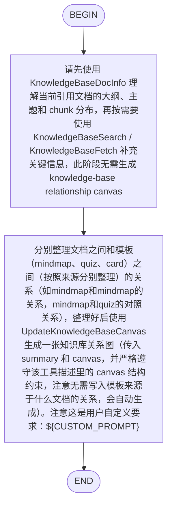

```mermaid
flowchart TB
    A(["BEGIN"]) --> B["请先使用 KnowledgeBaseDocInfo 理解当前引用文档的大纲、主题和 chunk 分布，再按需要使用 KnowledgeBaseSearch / KnowledgeBaseFetch 补充关键信息，此阶段无需生成 knowledge-base relationship canvas"]
    B --> C["分别整理文档之间和模板（mindmap、quiz、card）之间（按照来源分别整理）的关系（如mindmap和mindmap的关系，mindmap和quiz的对照关系），整理好后使用UpdateKnowledgeBaseCanvas生成一张知识库关系图（传入 summary 和 canvas，并严格遵守该工具描述里的 canvas 结构约束，注意无需写入模板来源于什么文档的关系，会自动生成）。注意这是用户自定义要求：${CUSTOM_PROMPT}"]
    C --> D(["END"])
```
