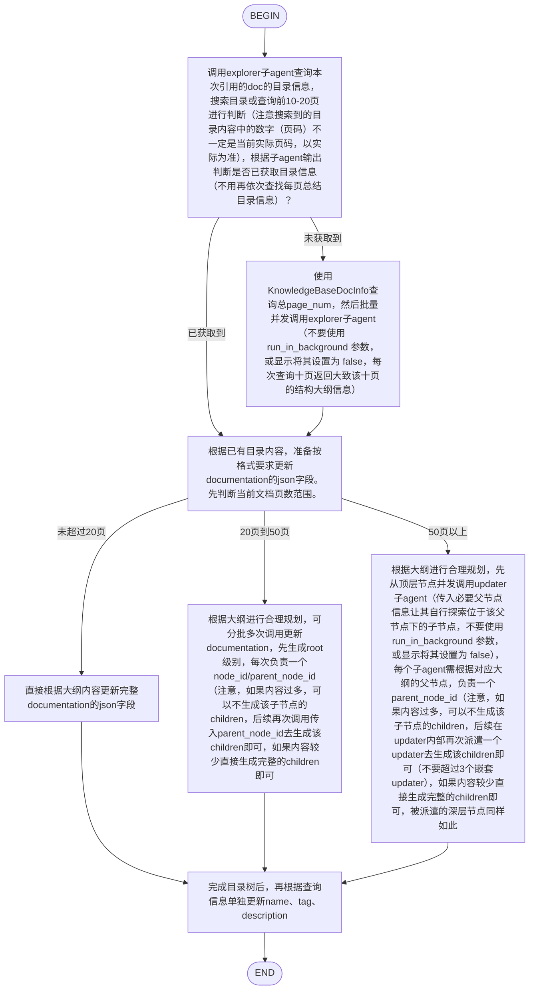

```mermaid
flowchart TB
    A(["BEGIN"]) --> B["调用explorer子agent查询本次引用的doc的目录信息，搜索目录或查询前10-20页进行判断（注意搜索到的目录内容中的数字（页码）不一定是当前实际页码，以实际为准），根据子agent输出判断是否已获取目录信息（不用再依次查找每页总结目录信息）？"]
    B -- 未获取到 --> C["使用KnowledgeBaseDocInfo查询总page_num，然后批量并发调用explorer子agent（不要使用 run_in_background 参数，或显示将其设置为 false，每次查询十页返回大致该十页的结构大纲信息）"]
    B -- 已获取到 --> D["根据已有目录内容，准备按格式要求更新documentation的json字段。先判断当前文档页数范围。"]
    C --> D
    D -- 未超过20页 --> E1["直接根据大纲内容更新完整documentation的json字段"]
    D -- 20页到50页 --> E2["根据大纲进行合理规划，可分批多次调用更新documentation，先生成root级别，每次负责一个node_id/parent_node_id（注意，如果内容过多，可以不生成该子节点的children，后续再次调用传入parent_node_id去生成该children即可，如果内容较少直接生成完整的children即可"]
    D -- 50页以上 --> E3["根据大纲进行合理规划，先从顶层节点并发调用updater子agent（传入必要父节点信息让其自行探索位于该父节点下的子节点，不要使用 run_in_background 参数，或显示将其设置为 false），每个子agent需根据对应大纲的父节点，负责一个parent_node_id（注意，如果内容过多，可以不生成该子节点的children，后续在updater内部再次派遣一个updater去生成该children即可（不要超过3个嵌套updater），如果内容较少直接生成完整的children即可，被派遣的深层节点同样如此"]
    E1 --> F["完成目录树后，再根据查询信息单独更新name、tag、description"]
    E2 --> F
    E3 --> F
    F --> G(["END"])
```
