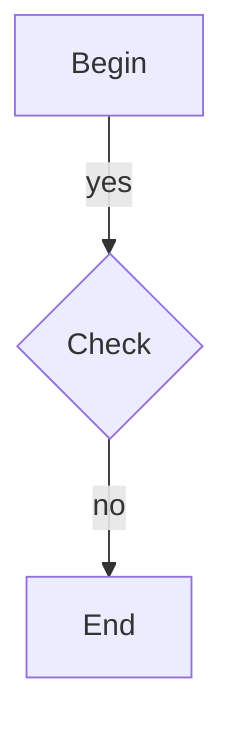

# 文件职责：描述 flow 技能中 mermaid flowchart 解析逻辑与语法约定

## mermaid 解析说明（mermaid.py）

### 入口流程
- 入口：`parse_mermaid_flowchart(text)`
- 逐行处理：去除行内注释（`%%` 之后）、空行、`flowchart/graph` 头部、样式/布局相关行
- 先尝试解析“边”，失败再尝试解析“节点”
- 汇总节点与出边后，推断分支节点，再调用 `validate_flow` 校验并返回 `Flow`

### 节点语法
- 基本形式：`node_id`，`node_id` 支持 `[A-Za-z0-9_][A-Za-z0-9_-]*`
- 形状 + 标签（可选）：`A[Label]`、`A(Label)`、`A{Label}`
- 圆括号支持嵌套方括号：`A([Label])`
- 标签支持双引号与转义：`A["a\"b"]`
- 未提供标签时，默认 label = node_id
- label 为空会报错

### 边语法
- 支持 `-->` 与 `---`，其中 `---` 会被归一化为 `-->`
- 支持不同箭头样式（例如 `-..->`、`-==>` 等），会归一化为 `-->`
- 支持两种边标签形式：
  - 管道：`A -->|label| B`
  - 中置：`A -- label --> B`
- 解析时会先抽取标签再归一化箭头

### 忽略与清洗规则
- 直接忽略的行：
  - `flowchart` / `graph` 头
  - `end`
  - `classdef`、`class`、`style`、`linkstyle`、`click`、`subgraph`、`direction`
- 行内样式 token 会被移除：`:::class_name`

### 节点类型推断
- 显式标签为 `begin`/`end`（不区分大小写）时强制设为 `begin`/`end`
- 若节点是 `task` 且出边数 > 1，则推断为 `decision`

### 错误与冲突
- 语法错误会抛出 `FlowParseError`，错误信息包含行号
- 同一节点 id 的定义冲突：
  - 若已有显式标签，后续仅有 id 的定义会被忽略
  - 若新的定义提供显式标签，会覆盖原先仅有 id 的定义
  - 若两次显式定义不同标签，报冲突

### 典型示例

